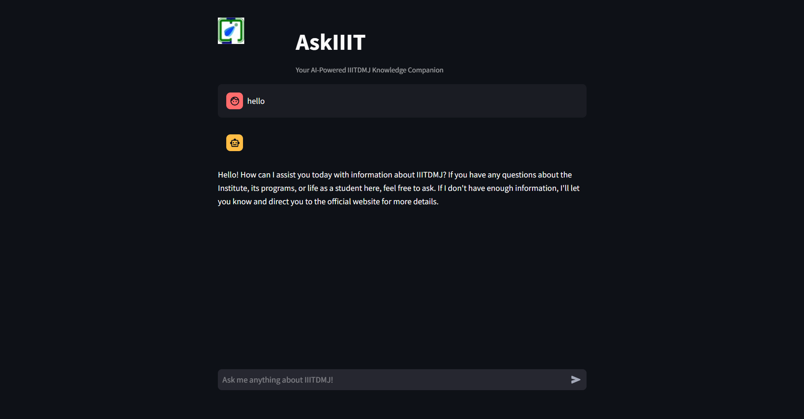

# AskIIIT
> Your AI-Powered IIITDMJ Knowledge Companion

## Overview
AskIIIT is a Retrieval-Augmented Generation (RAG) based chatbot specifically designed to answer queries about IIIT Jabalpur. Built using LangChain and Streamlit, it provides accurate, context-aware responses by leveraging the Mixtral-8x7B model through Groq.



## Features
- 🤖 AI-powered responses using Mixtral-8x7B model
- 📚 RAG-based information retrieval from IIITDMJ documents
- 💬 Interactive chat interface with typing animation
- 🎯 Context-aware and accurate responses
- 🔄 Persistent chat history
- 🎨 Clean and intuitive user interface

## Tech Stack
- **Framework:** Streamlit
- **LLM:** Mixtral-8x7B (via Groq)
- **Embeddings:** HuggingFace (all-MiniLM-L6-v2)
- **Vector Store:** FAISS
- **RAG Implementation:** LangChain
- **Environment Management:** Python-dotenv, Environs

## Installation

```bash
# Clone the repository
git clone https://github.com/yourusername/AskIIIT.git
cd AskIIIT

# Create and activate virtual environment
python -m venv .venv
.venv\Scripts\activate  # Windows
source .venv/bin/activate  # Linux/Mac

# Install dependencies
pip install -r requirements.txt
```

## Configuration
1. Create a `.env` file in the project root:
```env
GROQ_API_KEY=your_groq_api_key_here
```

2. Prepare your vector store:
```bash
python prepare_vectorstore.py
```

## Usage
1. Start the Streamlit app:
```bash
streamlit run app.py
```
2. Open your browser and navigate to `http://localhost:8501`
3. Start asking questions about IIITDMJ!

## Deployment
🚀 AskIIIT is live! You can try it out on **Hugging Face Spaces**:

🔗 **[AskIIIT on Hugging Face](https://huggingface.co/spaces/PrinceDeepakSiddharth12/AskIIIT)**

Simply visit the link, enter your query, and get instant AI-powered responses about IIITDMJ!


## Project Structure
```
AskIIIT/
├── app.py                 # Main Streamlit application
├── requirements.txt       # Project dependencies
├── .env                  # Environment variables
├── .gitignore           # Git ignore file
├── photo/               # Images and assets
│   └── iiitdmjLOGO.jpeg
├── vectorDB/            # FAISS vector store
└── README.md           # Project documentation
```

## Development
- The chatbot uses RAG to provide accurate, context-aware responses
- Responses are strictly based on the provided context to prevent hallucinations
- Typing animation enhances user experience
- Session state maintains chat history during user interaction

## Contributing
1. Fork the repository
2. Create your feature branch (`git checkout -b feature/AmazingFeature`)
3. Commit your changes (`git commit -m 'Add some AmazingFeature'`)
4. Push to the branch (`git push origin feature/AmazingFeature`)
5. Open a Pull Request

## License
This project is licensed under the MIT License - see the [LICENSE](LICENSE) file for details.

## Author
**Prince Deepak Siddharth**
- BTech CSE (2023 Batch)
- IIITDMJ

## Acknowledgments
- IIITDMJ for providing institutional data
- Groq for LLM API access
- LangChain community
- Streamlit team

---
Made with ❤️ at IIITDMJ
